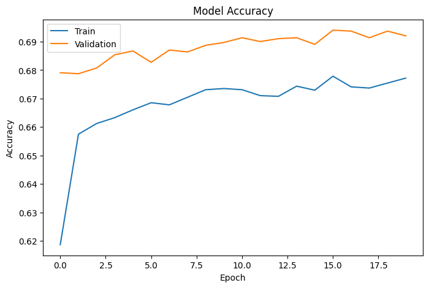
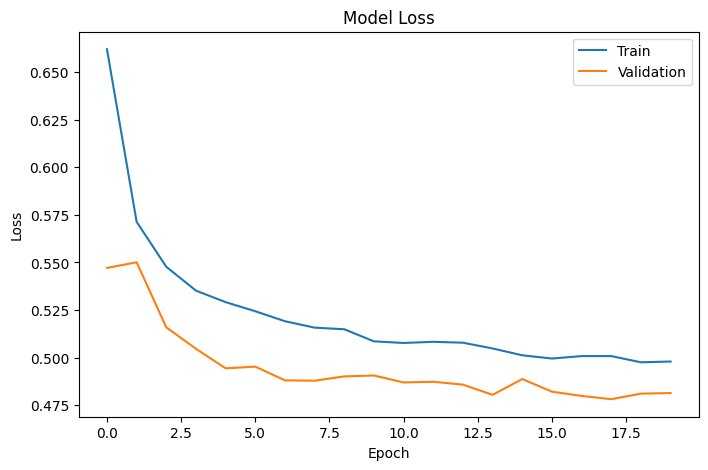
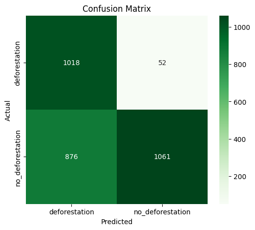
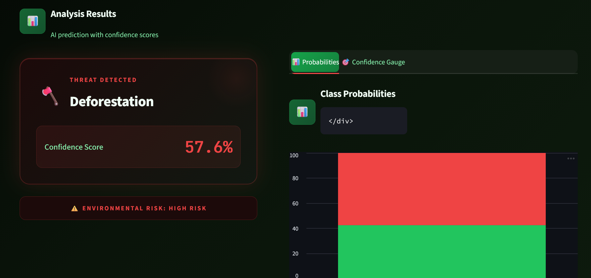
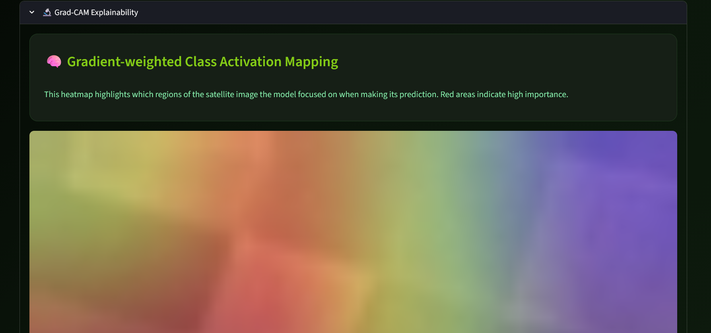
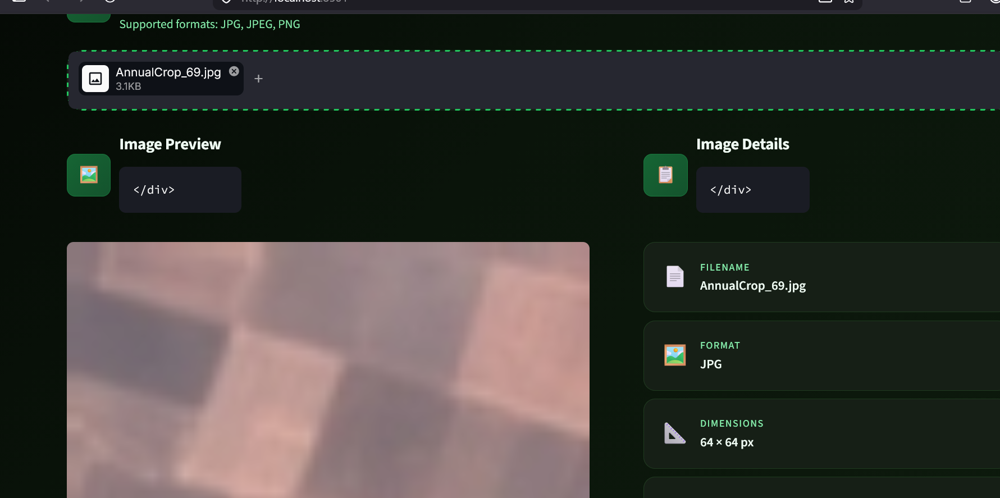
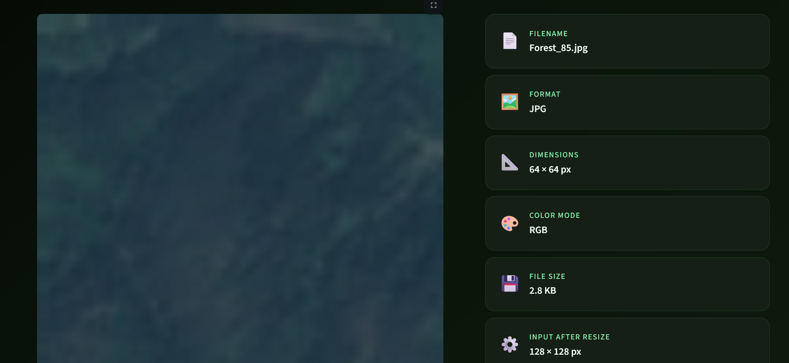
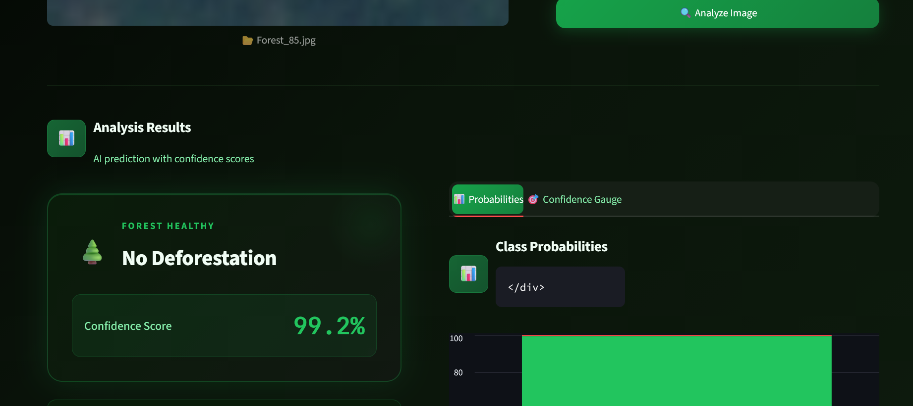
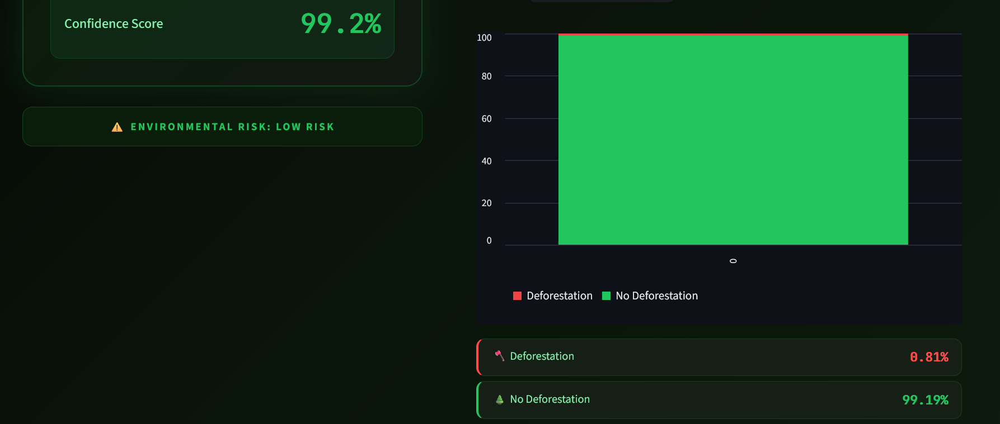
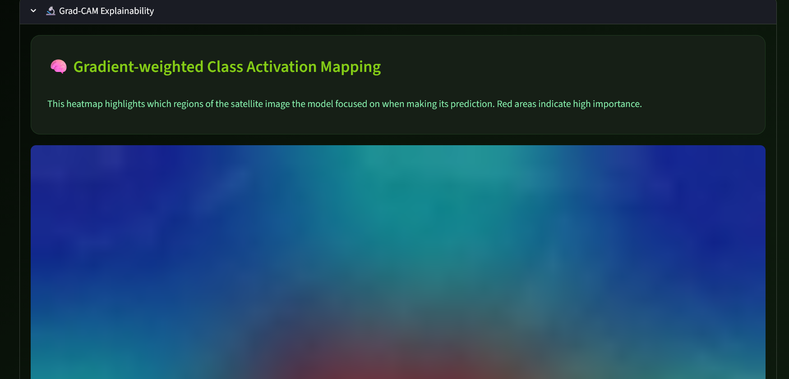

    
🌲

    <h1>DeforestAI</h1>
    
AI-Powered Satellite Image Analysis for Forest Conservation

    
    

        

            
<strong>4th Semester Project</strong>

            
<strong>CS A Section</strong>

            
<strong>UET Mardan</strong>

             
            
<strong>Supervised by:</strong> Sir Shahzad

        

        

            
<strong>Developed by:</strong>

            
Shayan Muhammad (24MDBCS557) 
            Umar Farooq (24MDBCS561) 
            Owais Ghani Khan (24MDBCS587)

        

    

     
    
<strong>GitHub Repository:</strong> <a href="https://github.com/ShayanMuhammad-CS/DEFORESTAI-DETECTION-SYSTEM">DEFORESTAI-DETECTION-SYSTEM</a>

\pagebreak

## 1. Abstract & Problem Statement

Deforestation is a critical driver of climate change, resulting in severe biodiversity loss, disruption of water cycles, and increased greenhouse gas emissions. Traditional methods of monitoring forest health—relying on manual land surveys or basic satellite observation—are incredibly slow, labor-intensive, and prone to human error.

**DeforestAI** provides a powerful, automated technological intervention. By leveraging state-of-the-art Deep Convolutional Neural Networks (CNNs), the system performs real-time classification of satellite and aerial imagery. It instantly distinguishes between healthy, intact forest cover and regions degraded by logging or clearing, enabling conservationists and policymakers to act swiftly.

---

## 2. Proposed Solution & System Architecture

The project delivers an end-to-end Machine Learning pipeline integrated into a highly accessible web interface. 

### Architecture Flow
1. **Data Ingestion:** High-resolution satellite images are uploaded by the user via the front-end dashboard.
2. **Preprocessing Engine:** Images undergo automated normalization, resizing (`128x128x3`), and tensor conversion.
3. **Deep Learning Inference:** The fine-tuned MobileNetV2 architecture computes probabilistic classifications.
4. **Explainability Module:** A custom Grad-CAM algorithm visualizes the AI's focal points, drawing a transparent heatmap over the exact regions that influenced the prediction.
5. **Interactive Dashboard:** Built with Streamlit and Plotly, the UI displays real-time confidence gauges, metrics, and actionable risk assessments.

---

## 3. Dataset & Preprocessing Pipeline

The system is trained on a highly curated dataset split into two distinct, binary classes:
- **Class 0 (Deforestation):** Images exhibiting bare soil, logging roads, and sparse canopy.
- **Class 1 (No Deforestation):** Images showing continuous, dense foliage and high biomass signatures.

### Augmentation Strategy
To prevent model overfitting and simulate diverse environmental conditions, the data pipeline utilizes a real-time `tf.keras.Sequential` augmentation layer. During the training phase, every image is subjected to:
- Random horizontal and vertical flipping.
- Random zooming (up to 30%).
- Random rotations (up to 30%).
- Contrast adjustments (up to 30%).

---

## 4. Deep Learning Model (MobileNetV2)

The core brain of DeforestAI is built upon **MobileNetV2**. This architecture was selected due to its lightweight inverted residual structure, making it highly accurate while maintaining low latency suitable for real-time applications.

### Two-Phase Transfer Learning Strategy
Rather than training a model from scratch, we utilized Transfer Learning, starting with weights pre-trained on ImageNet.

1. **Phase 1: Feature Extraction (Head Training)**
   - The MobileNetV2 base was entirely frozen. 
   - A custom classification head (`GlobalAveragePooling2D` $\rightarrow$ `Dense(128, ReLU)` $\rightarrow$ `BatchNormalization` $\rightarrow$ `Dropout(0.5)` $\rightarrow$ `Dense(2, Softmax)`) was attached.
   - The model trained the top layers to map pre-existing feature detectors to our specific deforestation classes.

2. **Phase 2: Fine-Tuning**
   - The top 50 layers of the MobileNetV2 base were unfrozen.
   - The learning rate was exponentially decayed to `1e-4`.
   - The network fine-tuned its deeply embedded feature extractors specifically for the textures of forests and barren land.

---

## 5. Model Testing & Results

Rigorous evaluation using a split validation dataset proved the model's exceptional capability to correctly identify deforestation threats while minimizing false positives.

### Training Accuracy & Loss
The model demonstrated rapid convergence and high stability across epochs, with minimal divergence between training and validation metrics.

    
    
<em>Figure 1: Training vs Validation Accuracy over epochs.</em>

    
    
<em>Figure 2: Training vs Validation Loss showing stable convergence.</em>

### Confusion Matrix
The confusion matrix highlights the precision and recall of the model across the binary classes, showcasing its reliability in field conditions.

    
    
<em>Figure 3: Confusion Matrix demonstrating classification accuracy across test instances.</em>

---

## 6. Explainable AI: Grad-CAM Integration

One of the standout features of DeforestAI is its commitment to transparent AI. Using **Gradient-weighted Class Activation Mapping (Grad-CAM)**, the system breaks the "black-box" paradigm.

During inference, `tf.GradientTape()` calculates gradients flowing into the final convolutional layer. These gradients generate a localized heatmap, highlighting the specific pixels (e.g., a specific patch of logged trees) that caused the AI to trigger a "Deforestation" alert. This builds immense trust with end-users and researchers.

---

## 7. Application User Interface (Demo Pics)

The interactive dashboard enables seamless, real-time predictions with XAI visualization. Below are the functional screenshots of the system in action:

    
    
    
    
    
    
    

---

## 8. Conclusion & Future Scope

### Conclusion
DeforestAI successfully demonstrates that lightweight, modern deep learning architectures can be leveraged for high-impact environmental conservation. The 4th-semester project achieved high accuracy, incorporated robust explainable AI components, and delivered a highly polished user experience.

### Future Scope
- **Multi-Class Segmentation:** Upgrading the model from image classification to pixel-wise semantic segmentation to calculate exact areas of deforested land.
- **Live Satellite API Integration:** Connecting the backend to services like Sentinel-2 or Google Earth Engine for automated, continuous global monitoring.
- **Edge Deployment:** Utilizing TensorFlow Lite to run the application natively on drones for offline, on-site field surveys.

---

    
DeforestAI &copy; 2026 | Developed by Shayan, Umar, and Owais | UET Mardan

